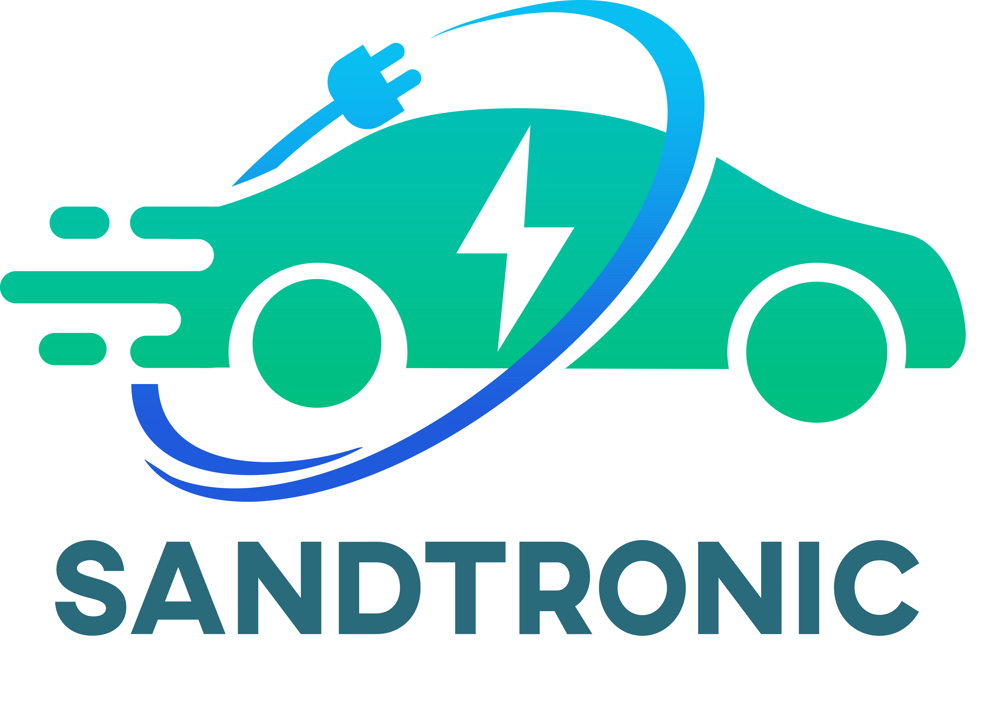
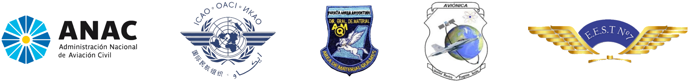
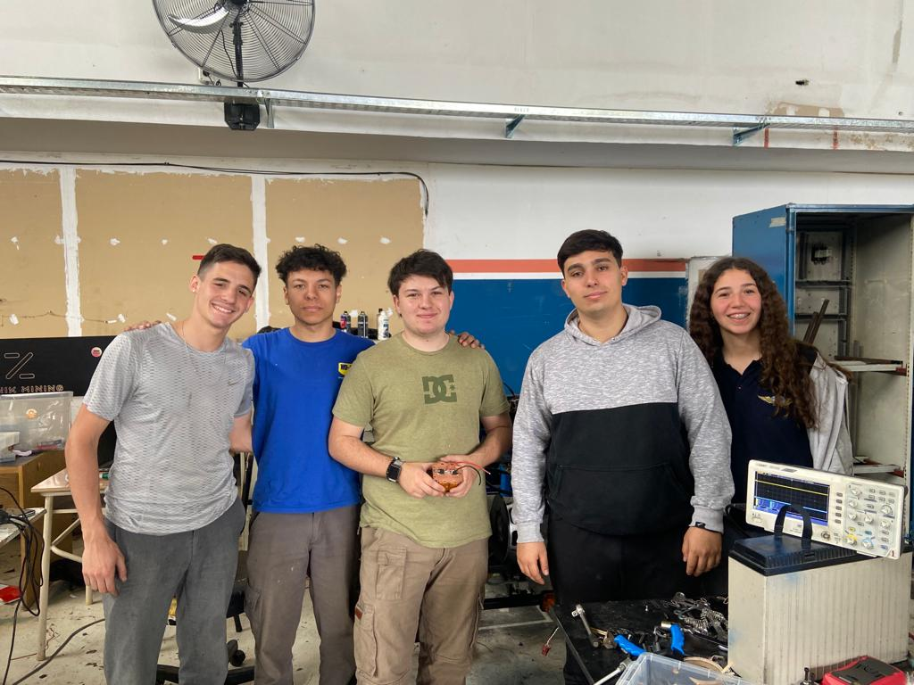

# **SandTronic**

# ¿Qué es SandTronic?
Es un karting eléctrico especialmente adaptado para su uso en playas, con el propósito de proporcionar un medio de transporte eficiente y seguro para situaciones de emergencia en las que los guardavidas necesiten rescatar a personas en peligro en el agua o en áreas remotas de la playa.

## ¿Quienes somos?

#### Somos un grupo de estudiantes de aviónica la E.E.S.T. "Taller Regional Quilmes", conocido como IMPA.

# Integrantes

* ###  *Alvarez, Mauricio*
    *    📧 Email: [maurialvarez2004@gmail.com](mailto:maurialvarez2004@gmail.com)         

* ### *Enricci Louzan, Carla*
    *    📧 Email: [carlamicaela2004@gmail.com](mailto:carlamicaela2004@gmail.com)

* ###  *Morellato, Nicolas*
    *    📧 Email: [morellatonico@gmail.com](mailto:morellatonico@gmail.com)

* ### *Vega Ezequiel*
    *    📧 Email: [ezevega44@gmail.com](mailto:ezevega44@gmail.com)

* ### *Zanichelli, Mateo*
    *  📧 Email: [mateo.zanichelli@hotmail.com](mailto:mateo.zanichelli@hotmail.com)

## ¿Dónde nos pueden encontrar?
### 📷Instagram: [@SandTronic_gr](https://instagram.com/sandtronic_gr?igshid=NzZlODBkYWE4Ng==)
### LinkTree: [SandTronic](https://linktr.ee/sandtronic_gr)
